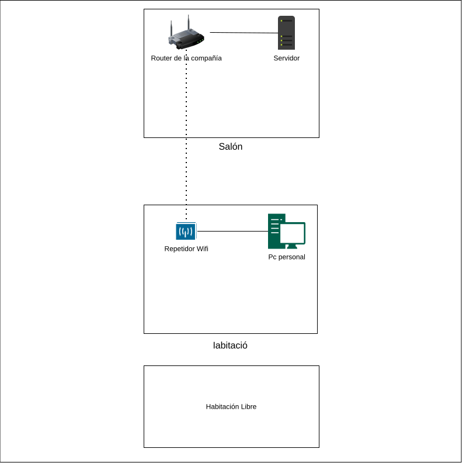
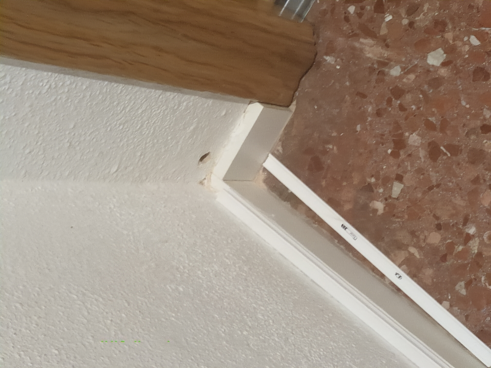
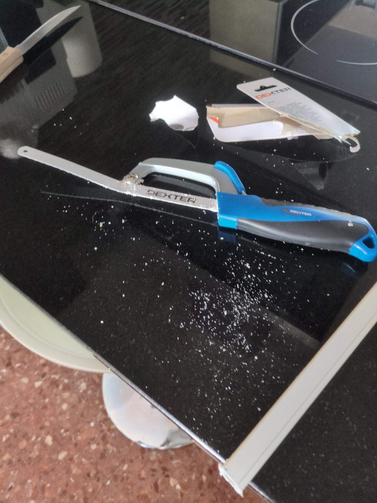
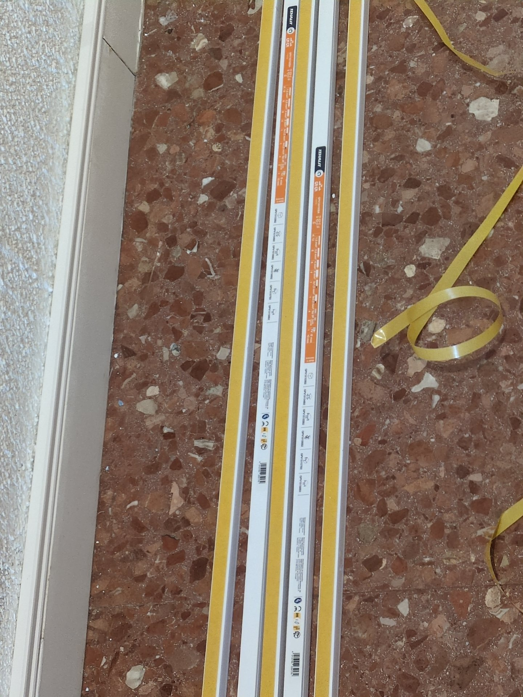
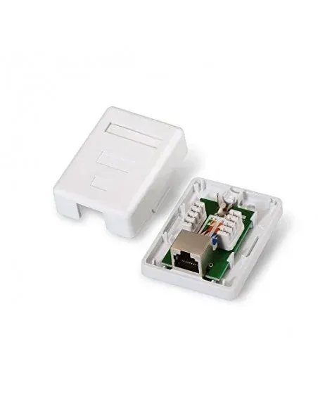
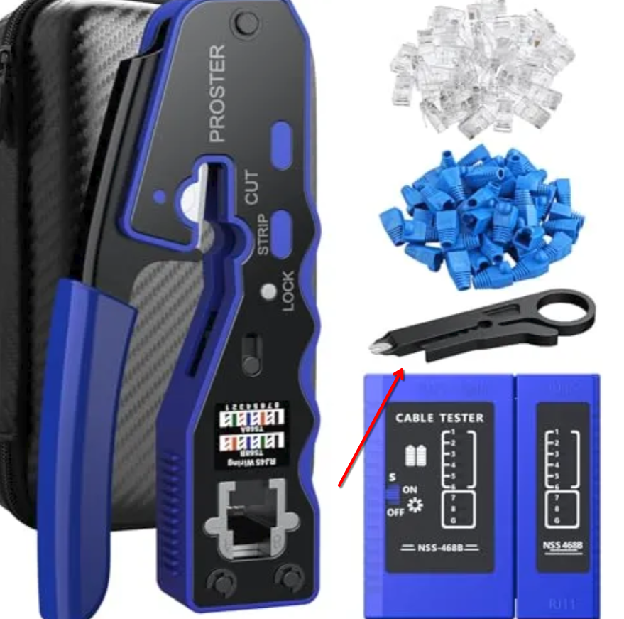
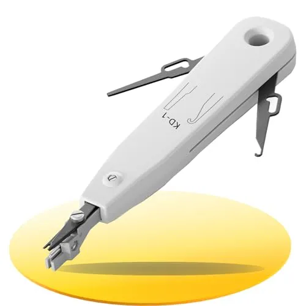
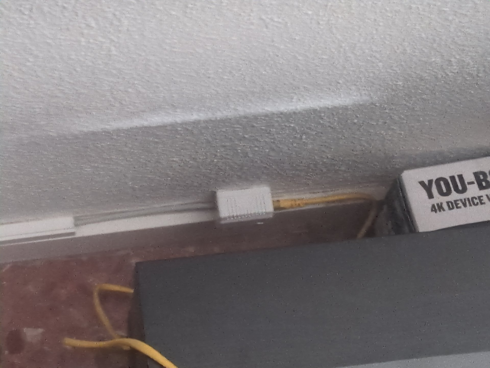

Llevo bastante tiempo pensando en quitar el router de la compañía de mi casa, y hasta que no he tenido todo el hardware y la infraestructura suficiente para hacerlo no he podido. Lo bueno es que ya ha llegado el día.

Para comprender como estaba todo antes de tocar nada creo que este diagrama ayuda bastante:

Todo estaba situado en el salón, y no tenía ningún cable de red pasado por ninguna parte. Esto me forzaba a tener el servidor anclado en una zona común de la casa y en la cual a veces no es conveniente que haya ruido. 

Uno de mis caprichos era llegar a tener una red preparada para los 10Gbps, para que, en un futuro, poder mejorar toda la infraestructura.

## Pasando el cable
Para mover el servidor a la otra punta de la casa (la única habitación libre) barajé varias opciones, ya que necesitaba tirar un cable de red desde el salón hasta la nueva ubicación (aprox 25m de csble).

### Cable por los cuadros de luz
Lo primero que pensé fue en tirar el cable por los diferentes cuadros que hay distribuidos por la casa. Esto sobre el papel parecía una buena idea, así que me hice con un cable de red rj45 de 30m, S/FTP por las interferencias que pudieran llegar a surgir y CAT 6A y con una guía pasacables.

La primera prueba la pasó bien, de caja a caja no hubo ningún problema, entró por una y salió por otra la canaleta, todo perfecto. Los problemas vinieron a la hora de pasar por una curva en específico de la casa. Da igual como pasase la guía, probé con infinidad de métodos que me aconsejaban o que leía en internet: con fairy, con saliba, con vaselina, por un lado, por el otro haciendo piruetas mientras la estaba metiendo o aspirando con una aspiradora mientras tapaba el otro lado con un papel por si había un poco de escombro haciendo tapón. Parecía imposible hacer que pasase la guía y al final la única solución que me quedaba si quería pasar el cable de este modo era haciendo un agujero en la pared para ver que es lo que pasaba, seguramente el tuvo estaría aplastado o directamente roto, no se puede saber si no se rompe la pared.

En mi caso hacer un agujero considerablemente grande para luego tener que taparlo no era una opción, así que me toco rendirme en este método.

### Canaletas
Ahora pasé a las canaletas, un método aparentemente más laborioso pero que tampoco daría una mala estética y dejaría el trabajo hecho, así que me puse a ello con ayuda de mi padre.

#### Agujeros 

Lo primero que hicimos fue decidir qué trayectoría iba a tomar el cable, donde iba a girar y por qué paredes iba a penetrar. Una vez decidido esto con un taladro hicimos los agujeros para que pasara el cable: 

En total tuvimos que hacer 3 agujeros, 2 para llevar el cable al pasillo principal y meterlo en la habitación correspondiente y uno más para pasar de esa habitación a la mía. Quería aprovechar ya que hacíamos toda la instalación a poner una toma de red en mi habitación ya que hasta el momento mi ordenador principal estaba yendo por WiFi.

#### Canaletear
Decidimos que el cable iría pegado al rodapiés y bordeando los marcos de las puertas, así que tuvimos que medir, cortar y pegar cada regleta:

Poco a poco fue quedando todo bastante bien, sí que es verdad que hay algunos giros y zonas en las que se puede ver el cable, esto tiene solución con unos codos especiales que nos faltaron por comprar pero en un futuro los pondremos.

También me dí cuenta que al tener las paredes con estucado el adhesivo de la canaleta pierde eficacia pero después de varios meses no se ha notado a simple vista un deterioro de ninguna de ellas. Sí que creo que, si se pretenden pasar varios cables por la misma canaleta, sería lo suyo atornillar cada una a la pared.

## Los finales del cable
La opción de pasarlos por dentro de la pared me seducía mucho por la despreocupación que podía tener después de pasar el cable. Me gustaba que una vez terminada la instalación siempre podía estra completamente seguro de que el problema no iba a ser el cable si algún día tenía problemas de algún tipo.

Es por esto que quería montar algo similar pero con el cable por fuera. Yo creía que no sería posible pero hablando con profesores me acabé enterando de la existencia de rosetas de pared para rj-45:

Este concepto me venía como anillo al dedo. Buscando acabé encontrando también metálicas para cables con sellado y poder prevenir en ambos finales las interferencias y de la velocidad que yo buscaba, CAT 6A. No había necesidad de agujerear la pared, que si se quiere se puede hacer para mantenerlos más sujetos, pero con un poco de cinta adhesiva de doble cara que venía con la propia roseta parecia suficiente.

Para crimparlo sí que fue todo una odisea...

### Crimpado

Como se puede ver en la 
imagen anterior el cable entraría a la roseta para ser crimpado con una herramienta de impacto especial. Esto no lo ví demasiado complejo desde fuera, principalmente porque tenía lo que yo pensaba era la herramienta:

Había comprado un kit como este, y tenía entendido que la herramienta la cual he señalado también podía usarse para crimpar este tipo de conexiones, al final acabé sin saber si esto anterior era del todo cierto.

Intenté crimpar los finales con esta herramienta y que experiencia más mala, por dios.

No acabé de descrifrar del todo cual era la causa de que las conexiones entre los dos finales no llegaran a pasar de los 100Mbs, sí que entiendo que algun que otro par no estaba haciendo el contacto que debería pero no pude resolver si era porque estaba haciendo demasiada fuerza o demasiada poca. 

Después de incontables intentos de crimpado en ambos lados acabé desistiendo y decidí comprar una herramienta de crimpado de impacto dedicada únicamente a este propósito, algo muy similar a esto:

Y madre mía la diferencia fue abismal, la comodidad que me dió esta herramienta fue tremenda. a la primera se crimpaba todo perfecto con las velocidades debidas y de una manera mucho más aseada.

### Pegado

Para mantener las rosetas fijas a la pared venían con ellas unos adhesivos de doble cara que parecían venir muy bien. Los puse en las rosetas, las puse en la pared y durante unos días todo parecía perfecto, hasta que se empezaron a despegar.
Entiendo que alomejor no eran de la mejor calidad los adhesivos, no sé si por la humedad o que es lo que generó esto pero tuve que comprar una cinta de doble cara a proposito que hasta el momento no parece decepcionar.

## Cúlmen

Ya cuando tenía el cable principal pasado a trevés de la casa repetí el mismo proceso para pasarlo a mi habitación con el cable sobrante, y ya en el siguiente capitulo explicaré como se gestiona todo esto de una menra más lógica, por ahora esto es toda la instalación de cableado de red. 

