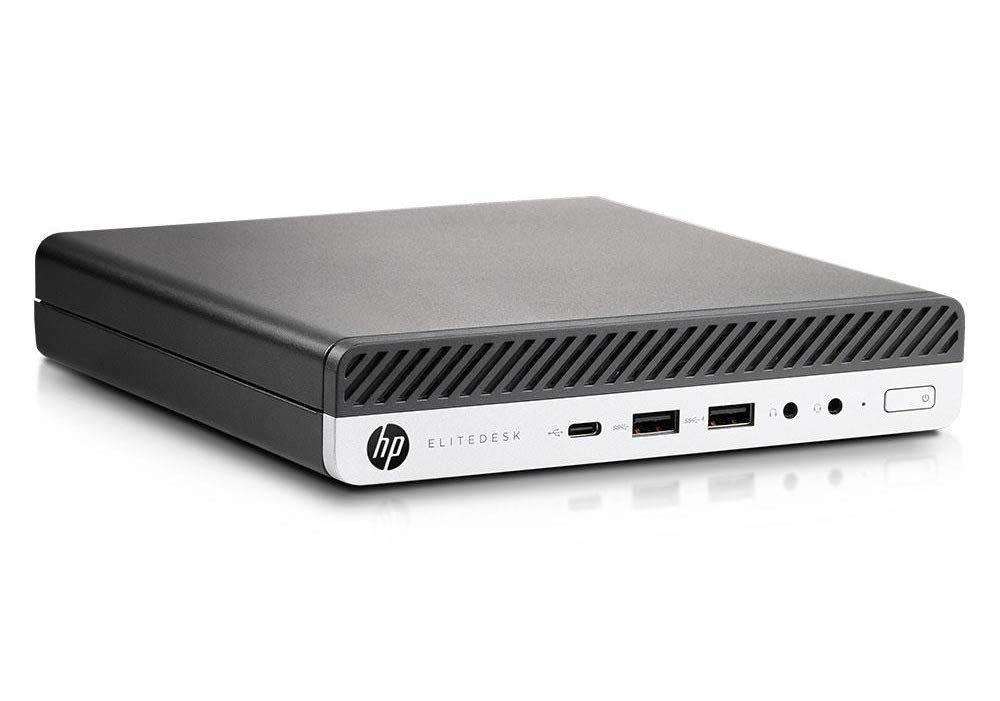
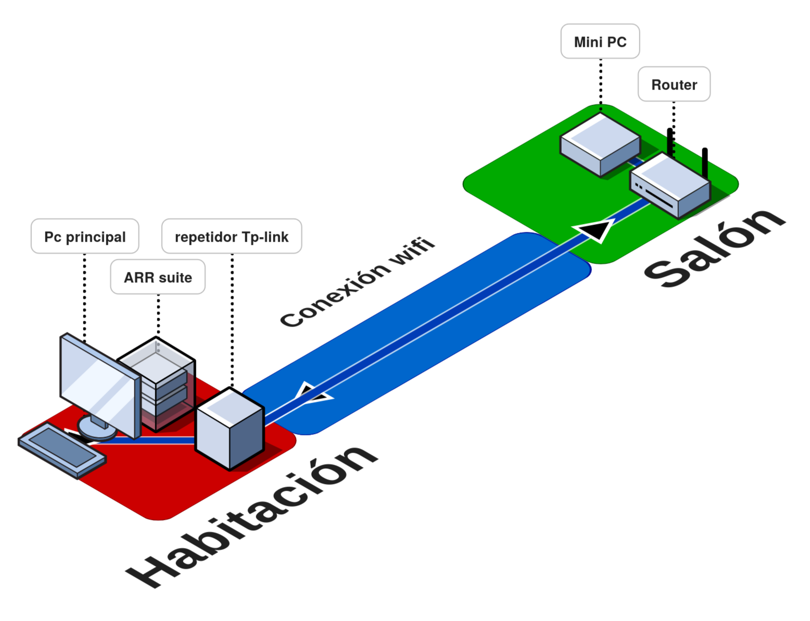

## Contexto

Antes de comenzar a explicar el proceso creo que lo mejor es explicar la organización física que manejo en mi red.

### Mini PC

Como punto de acceso para la mayoría de mis servicios tengo un mini PC hp situado en mi salón, este se encuentra muy cerca del router y conectado por cable al mismo para maximizar su rendimiento, dado que accedo a él a través de la webUI de Proxmox y la mayoría de sus funciones requieren una conexión a internet decente y estable no me quedaba otra. Este funciona con un sistema de refrigeración por turbina (lo cual no es muy ideal) y es recuperado de la dana de valencia. Estos vendrían siendo sus componentes principales y una foto de su apariencia:

| COMPONENTES    |           |
| -------------- | --------- |
| CPU            | I5-8400T  |
| RAM            | 16GB DDR4 |
| ALMACENAMIENTO | 256GB M.2 |

Es en esta máquina en la que tengo Proxmox instalado en el cual tengo varios contenedores funcionando como adguard y pihole o esta misma página web.
### PC

Por otro lado encontramos mi ordenador personal, en el cual están alojados mis servicios de media y algunos tests aleatorios (esto se debe a que fue en esta máquina en la que comencé a trastear). Estos vendrían siendo sus componentes principales:

| COMPONENTES    |                                 |
| -------------- | ------------------------------- |
| CPU            | Ryzen 5 3600                        |
| GPU            | Rx 5600x                        |
| RAM            | 16GB DDR4                       |
| ALMACENAMIENTO | 128GB SSD SATA 2TB HDD          |

## Por qué?

Ahora con mi configuración sobre la mesa puedo empezar a exponer los motivos por los cuales considero necesaria una migración. 

### Desventajas del MiniPC

Comenzando principalmente por la inconveniencia que genera el mini PC por ser lo que es. Con esto me refiero al hecho de que sea un pc en miniatura acaba generando situaciones indeseadas para un ordenador que necesita estar encendido 24/7. Por ejemplo, (dado que está situado en una zona común de la casa, como es el salón) por lo que comenté anteriormente del tipo de refrigeración a turbina, al tragar aire es difícil que no genere un mínimo de ruido aún en estado de reposo, esto acaba siendo bastante molesto. 

Por otro lado, el bajo nivel de escalabilidad que se encuentra en una máquina en miniatura es notable. En cuestiones de almacenamiento, potencia o expansión se ve una clara desventaja contra un ordenador de sobremesa. 

Tampoco me da mucha confianza el tipo de fuente de alimentación externa para este tipo de funciones, ya que acaba cogiendo temperaturas considerables.

Quiero recalcar que no creo que todos los mini PCs vayan a dar el mismo rendimiento que el mío, pero esta es mi experiencia personal y creo que el cambio es lo correcto. Ya que sé que muchas infraestructuras domésticas se basan en este tipo de máquinas y funcionan sin problemas no descarto el uso de algo similar en el futuro.

### Desventajas del ordenador personal

Mi ordenador personal se encuentra a una distancia considerable del router y resulta imposible hacerle llegar un cable directo. Es por esto que se acaba conectando a internet mediante un repetidor WiFi tplink. Esto es inconveniente a la hora de hacer uso de los servicios de streaming (como jellyfin) los cuales están instalados en esta máquina ya que fue donde comencé todo. 

También consideró que este ordenador (ya que es el mío personal) no debería tenerlo tanto tiempo encendido, por motivos de vida útil y conveniencia. 

Por estos motivos una de las partes del proceso también incluirá migrar los servicios de esta máquina a la nueva. Aunque esto será algo más tedioso.

## Proceso

### Primera migración

El cambio más urgente es el del mini PC por las razones comentadas anteriormente. 

Como ya he mencionado, el sistema operativo que ha estado funcionando es Proxmox. 
Después de estar un tiempo barajando opciones para realizar el cambio opté por hacer un cluster con las dos máquinas. Esto me llevó a instalar proxmox en el nuevo ordenador.

### Pasos para hacer un cluster

