Una de las cosas más urgentes en todo mi desarrollo era un NAS, un lugar el cual de manera segura, fácil y rápida sea capáz de guardar y coger información. Para servicios como Jellyfin (Peliculas y series) o immich (Fotos y videos) era de vital importancia, además para otro tipo de uso más cotidiano me venía bien.

## Planteamiento

Como no voy sobrado de hardware pues no me quedó de otra que de virtualizar una máquina en Proxmox (Aunque en un futuro piense dedicar una máquina entera para este propósito debido a su importancia). Esto al principio parecía una tarea fácil, coger la ISO, crear la máquina, bootear desde esta y pasarle los discos a la máquina. Pero esta última parte me acabó trayendo algunos problemas, que me acabó llevando incluso a la reinstalación de proxmox completa.

## Creación de la máquina

La parte fácil era crear la máquina virtual con TrueNAS, la cosa se me hizo cuesta arriba el momento de pasar los discos.

Todo comienza con la premisa de que no se le pueden pasar los discos de cualquier manera a una máquina virtual de este estilo, lo que pretendemos es pasarle los discos en el estado más crudo posible como si fueran realmente suyos. Para conseguir esto hay dos maneras de hacerlo:
· La primera sería pasando los discos de manera individual haciendo uso de su número de serie y añadiendolos al archivo de configuración de la máquina, ya sea mediante comando o a mano. 
· La segunda es pasarle directamente la controladora SATA a la máquina.
Inicialmente yo opté por la primera (Ya que era la única que conocía de primeras). Así que creé la máquina con 32 GB de disco virtual con emulación de SSD para mejorar el rendimiento, le puse también 2 núclos y 10GB de RAM. El mínimo recomendado para esta instalación son 8 así que ya que tengo 16 pues le he dado un poco más de margen aunque sea para la instalación. Instalé sleccionando la opción de configurar a través de la GUI y todo fluyó de manera correcta.

## Primeros problemas
Como ya he mencionado antes intenté pasar los discos de manera individual así que para ello lo primero que hize fue buscar el número de serie:

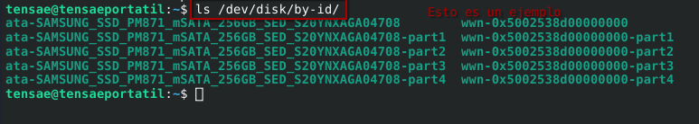

fuí apuntando cada uno en un blog de notas y creando el comando al lado para que solo sea copiar y pegar en proxmox:

```
qm set <VM-ID> -scsi<n> /dev/disk/by-id/SOME-DISK-ID

**En la práctica podría quedar algo así:**

qm set 101 -scsi1 /dev/disk/by-id/ata-SAMSUNG_SSD_PM871_mSATA_256GB_SED_S20YNXAGA04708

**Haríamos esto por cada disco que desearamos pasar.**

```

Después de introducir los comandos acabé apagando la máquina y volviéndola a encender para que cogiera todo debidamente y los discos aparecieron como era de esperar en la pestaña de configuración.

En este punto todo parecía ir de maravillas pero me encontré con dos problemas cruciales en adelante.

Lo primero de lo cual me dí cuenta era de que los discos no eran capáces de proporcionar valores S.M.A.R.T a TrueNAS, ya que TrueNAS los detectaba como discos virtuales, entendí que esto se debía a que en este método aún quedaba una pequeña capa de abstracción que separaba este software con los propios discos, así que no era capáz de programar tests completos para la salud de los discos periódicamente. Lo que me acabó llevando definitivamente a intentar el otro método fue un error que me dió TrueNAS cuando fui a crear el pool, resulta que veía los tres discos duros como iguales y no era capáz de diferenciarlos. 

Con estos dos inconvenientes me lanzé al otro método, el cual requería hacer PCI passthrough de la controladora SATA. Al hacerlo ya proxmox me soltaba este error relacionado con el IOMMU:

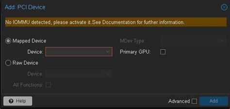

Esto ya saltaba alarmas y resulta que al entrar a la máquina no detectaba nada. 
Me informé y resulta que para que el IOMMU funcione debidamente es necesario activar VT-d (en el caso de intel) en la BIOS, sin esto activado es imposible hacer uso de esta tecnología. Así que me puse a ello, y al bootear de vuelta proxmox parecía haberse quedado completamente inutilizable. No me dejaba entrar por SSH, la Web estaba completamente inaccesible y ni con acceso físico me permitía hacer nada. Es en esta situación que, aprovechando que tengo una copia de seguridad de mis contenedores y VMs decidí reinstalar el sistema operativo entero.




Tengo que decir que es posible que al cambiar ciertos componentes (como la RAM en mi caso) estos ajustes de la BIOS se restauren a por defecto y nos puede dar problemas.




Al hacerlo restauré todo y le pasé la controladora SATA a la máquina, a simple vista todo parecía ir bien, me dejaba crear el pool y parecía funcionar correctamente, los problemas vinieron cuando comenzé a intentar tocar cosas en proxmox el cual se empezo a quedar pillado e intenté reiniciar.

Resulta que no me había dado cuenta del detalle de que si le pasaba la controladora SATA entera a la máquina virtual el propio proxmox perdía acceso a ella y por lo tanto al sistema operativo, es decir, acababa de restringir acceso al sistema operativo del sistema operativo, jeje.

### Reinstalación

Así que tuve que reinstalar todo de vuelta haciendo uso de la copia de seguridad. 

Ahora, habiendo entendido que esta segunda opción no era viable para mí en el momento, ya que mi sistema no estaba instalado en un m.2 u otro dispositivo independiente de la controladora SATA.

Me tocó seguir intentando el método anterior y entender por qué me estaba dando el error a la hora de crear el pool con los discos.

Rebuscando llegué a la solución de que los discos necesitan ser identificados con su número de serie, ya que a la máquina no le vale con el id de su ubicación. Para entenderlo mejor:

Para pasar los discos a la máquina virtual de manera individual haríamos lo siguiente:

- Primero revisaríamos los id de los discos:
```bash
ls -la /dev/disk/by-id/
```
Con la salida de este comando probablemente nos saldrán más salidas de las que realmente buscamos, pero no es comlicado identificarlas ya que las que queremos comienzan con `ata`

- Lo siguiente que haremos será coger el path de cada una e introducirlo con el siguiente comando:
```bash
qm set <VMID> --sata1 /dev/disk/by-id/ata-<ID_DISCO_1>
```

Esta es la forma en la que lo hice, pero no sabía que me faltaba agregar el número serial al final del comando para darle una identidad única al disco y que no parezca igual que los demás quedando el comando así:

```bash
qm set <VMID> --sata1 /dev/disk/by-id/ata-<ID_DISCO_1>,serial=<SERIAL_1>

```

El serial puede ser la última parte del id del disco.

Si ya has puesto el disco sin el serial es posible ponerlo sin tener que introducir todo el comando de vuelta desde la misma GUi de proxmox.

## 1ra Puesta en marcha

Ahora todo iba sobre ruedas (o almenos eso parecía), el pool lo creaba bien, era capáz de acceder a él desde cualquier lado, mis servicios podían usar el contenido, todo parecía fluir.

Sí que es verdad que había una cosa que aún no había sido capáz de hacer que era lo de los valores SMART para llevar un control del estado de salud de mis discos, pero bueno, me quedé con que todo funcionaba y que trueNAS no parecía quejarse.

### El desastre 

Proxmox dejo de proxmoxear.

El sistema de archivos parecía haberse empezado a corromper y se puso en modo solo lectura para autorpotejerse (almenos eso decía en la pantalla), todo parecía haberse venido abajo y al ver esto se me ocurrieron dos hipotesis para la causa:

1. Que el trabajo de backup que tenía era el responsable ya que me estuvo dando error al hacer backup varias veces, pero lo ví poco probable ya que parecía una consecuencia demasiado grave para algo así.
2. Mi segunda hipotesis fue que el disco en el cual estaba instalado el sistema no estaba en perfectas condiciones, y era viable ya que era de segunda mano, era posible que algún sector se hubiera muerto y eso haya causado un efecto cascada en el sistema.

Me decanté por la segunda y al ver el panorama lo primero que pensé fue que no quería tener que lidiar con este tipo de problemas nunca más, así que me hice con un nuevo disco duro.

Esta vez un m.2 NVME, por desgracia la placa base que uso no soporta m.2 de forma nativa pero con un adaptador PCI funcionó de maravilla.

La diferencia era brutal, instalando el sistema, cargando archivos, cualquier cosa iba mucho más rápido y ligero, entiendo que es lógico usando un tipo de almacenamiento más rápido, pero más que nada quería recalcar que valió mucho la pena la mejora.

### La recuperación

Ahora venía la parte complicada, porque como he dicho antes las copias de seguridad me estaban fallando y ciertas cosas importantes (Como las máquinas virtuales y algún que otro contenedor) no tenían copia de seguridad y estaban aún en el disco antiguo aparentemente dañado.

Para intentar ver lo que podía recuperar inicé con una LiveCD de gentoo que tenía a mano, obviamente con interfáz gráfica aunque también tuve que tocar la terminal un poco.

#### Los contenedores

Con la live CD pude ver que no estaba todo perdido y el propio sistema provisional me detectaba las particiones LVM de los contenedores para poder montarlas y ver sus propios sistemas lo cual me dejó bastante tranquilo. También pude confirmar que no había perdido las copias de seguridad que tenía en el disco externo y con eso ya había salvado todos los contenedores.
En parte eran importantes pero lo que más me preocupaba era la recuperación de las dos maquinas virtuales a las que últimamnte les había echado mucho tiempo.

#### Las máquinas virtuales

Para la recuperación de la primera máquina, (que era la que usaba para la suite de arr) conseguí ingeniarmelas para montar su disco en el sistema live, a partir de ahí fuí capáz de navegar hasta una carpeta que creé llamada docker en la cual tengo el 100% de archivos necesarios para los contenedores.
Siempre que creo un contenedor creo una subcarpeta dentro de la de docker con el nombre del contenedor y es aquí donde dejo el docker compose con las carpetas de configuración de los contenedores mapeadas, así en casos como este solamente tengo que copiar recursivamete esta carpeta al disco duro externo y solo tendría que crear otra máquina virtual y pasarle todo.

Ahora para la segunda máquina de trueNAS sabía que no iba a ser tan fácil, debía de encontrar el disco virtual y exportarlo a un formato .raw, conseguí hacerlo con la herramienta dd (he de admitir que aquí sí tuve que hacer uso de la IA). 
Los pasos que hice fueron:

- Listar los volumenes lógicos:
```bash
lvs
```
- activar LVM por si no estuviese activado:
```bash
vgchange -ay
```

Con la salida del primer comando podemos empezar a trabajar ya que nos debería devolver el nombre del disco que estamos buscando, con esto ya podemos encontrarlo en una ruta similar a:
```bash
/dev/pve/<Nombre_del_disco>
```

y ya solo nos queda aplicar el comando dd:

```bash
dd if=/dev/pve/vm-<VMID>-disk-0 of=/mnt/backup/vm-<VMID>.raw bs=4M status=progress
```
El 'of=' es el archivo resultante que nos va a dar, es por ello que debemos de ponerlo dircetamente en un lugar seguro como en un disco externo.

---
Con esto ya tendríamos lo esencial de las dos máquinas virtuales.
Intenté también extraer los archivos de configuración de la de TrueNAS pero se me complicó mucho y empezé a dejar de verle sentido ya que la infromación como tal ya la tenía y costaba 30 segundos crear una máquina virtual sin disco y ponerle la configuración que deseaba.

### Restauración

Como ya he comentado antes instalé el sistema en el m.2 nuevo y empezé a cargar la copia de seguridad de los contenedores en el sistema:

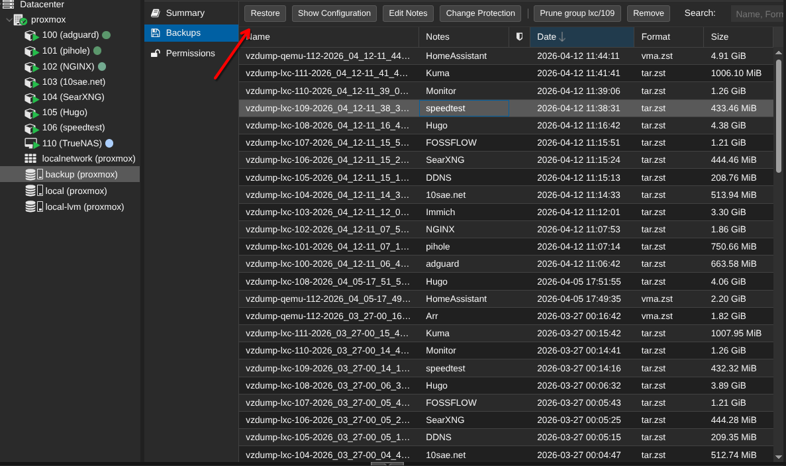

Proxmox lo deja muy fácil en este aspecto.

Ahora con todos los contenedores principales recupertados, necesitaba recuperar las dos máquinas, TrueNAS era la esencial, así que lo primero que hice fue crear una máquina virtual sin disco, sin live cd y con las especificaciones que necesitaba:

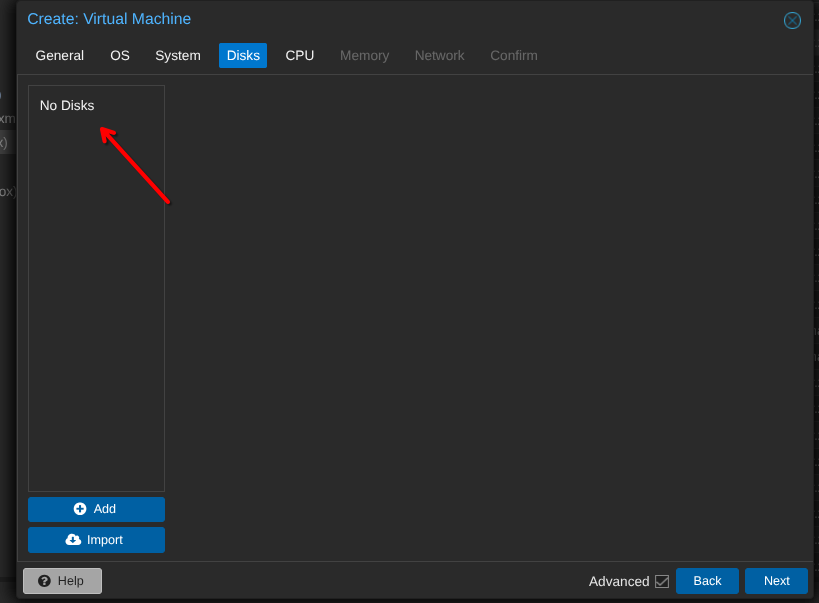

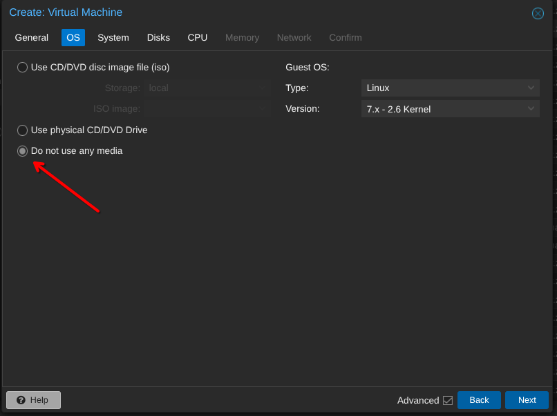

Creé la máquina sin encenderla y teniendo el archivo .raw ubicado en mi nuevo sistema introducí el siguiente comando en la terminal para darle el disco a la máquina:

```bash
qm importdisk <VMID> /ruta/al/archivo.raw <storage>
```

en mi caso quedó así:

```bash
qm importdisk 110 /mnt/backup/vm-110.raw local-lvm
```

Proxmox se quedará cargando un rato y cuando termine ya tendremos nuestra máquina casi lista, solo nos quedaría habilitarle a la máquina el boot desde el nuevo disco y estaría acabado:

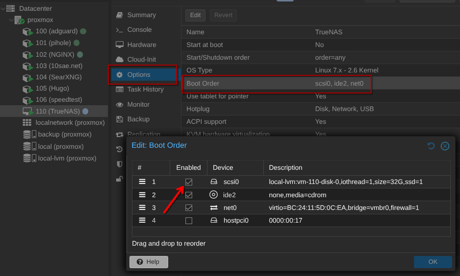

También recomiendo que si vais a usar TrueNAS habilites la virtualización anidada, ya que en un rato nos hará falta:

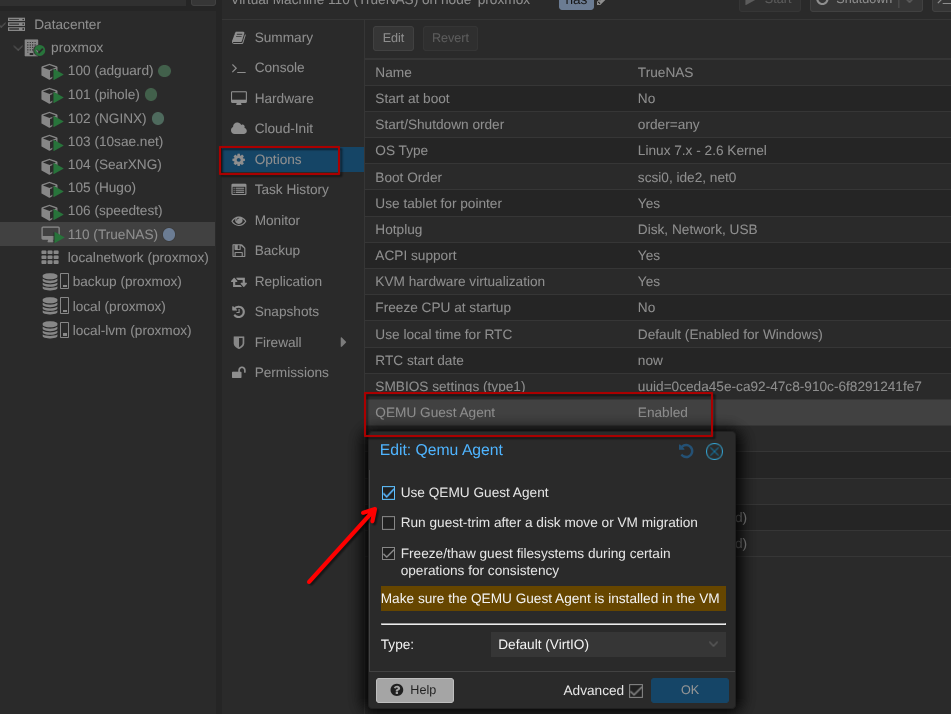

Ahora ya teníamos la máquina virtual lista para funcionar, excepto por un pequeño detalle: los discos.

---
Para la máquona de arr simplemente era crear otra e importarle la carpeta anteriormente nada del otro mundo.

## 2nda puesta en marcha
Me estuve informando y resulta que la forma en la que anteriormente acabé gestionando los discos no acababa de ser la más idonea, sí que es verdad que funcionaba el hecho de pasarle cada disco individual a la máquina pero no llegaba a darle el control total necesario sobre los mismso y esto en el futuro puede acarrear conflictos. 

Se ve más claramente cuando en TrueNAS con este método vas a ver información sobre los propios discos y este dice que son virtualizados, es decir, no los coge tan directamente aún teniendo bastante control sobre ellos.

Es por esto que, ahora con el m.2 independiente de la controladora SATA, me era viable hacer PCI passthrough de la controladora SATA, y es lo que hice:

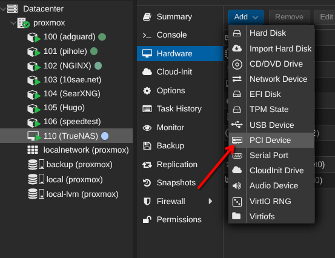

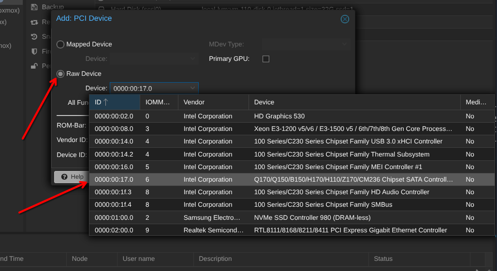

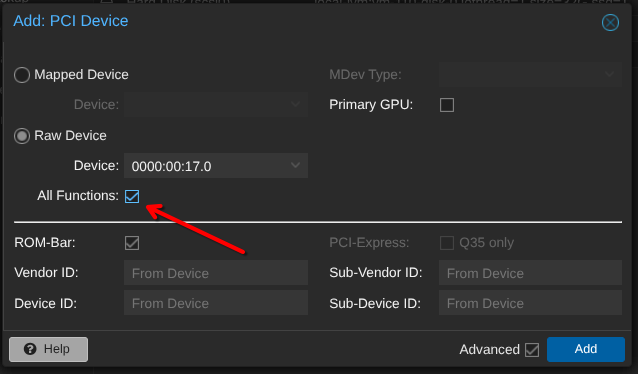

Esta es la manera correcta de hacerlo y así nos evitamos problemas en el futuro ya que TrueNAS controla realmente todos los discos SATA del sistema.

Ahora al iniciar de vuelta la máquina con el disco importado y todo bien configurado todo funcionó automáticamente, el pool cogió los discos que eran bien (tiene sentido porque ya tenía el serial guardado de cada uno) pero ya no decía nada de virtualizados.

## Valores S.M.A.R.T
Una de las monitorizaciones que más me importaban en ese momento era esta. Quería saber cómo estaban mis discos siempre que quisiese.

Antes pensaba que no podía realizar este tipo de tests debido a esa capa de abstracción que quedaba pero no podía estar más equivocado, ya que al hacerlo de este nuevo método tampoco veía la opción que veía en todas las guías de otra gente. 

Al final, investigando en la página oficial de TrueNAS acabé leyendo que habían dejado de dar ese tipo de servicio de forma nativa y que recomendaban instalar una aplicación sobre el propio TrueNAS llamada `Scrutiny`.

Ahora es cuando coge sentido lo de habilitar la virtualización anidada.
Para poder instalar aplicaciones y contenedores en general dentro de TrueNAS necesitamos el servicio de docker activo, el cual no para de darte fallos a menos que actives esto.

Así que en la pestaña de apps la instalé:

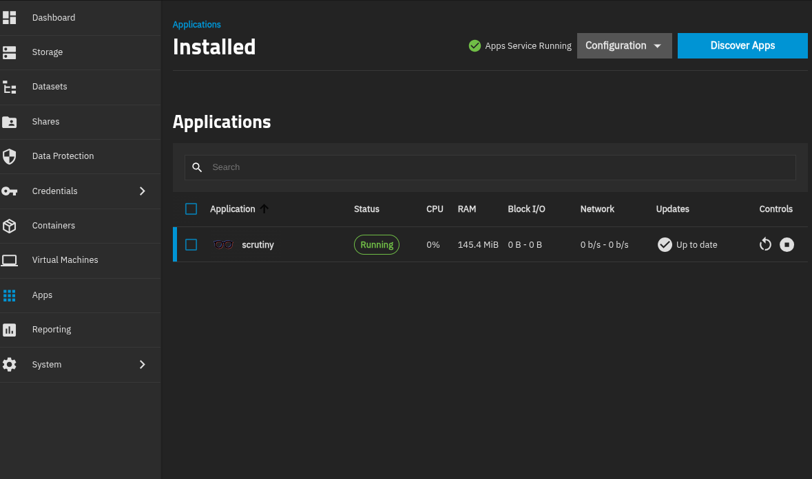

y yendo al puerto 31054 de mi truenas fuí capáz de ver toda la informacion necesaría de mis discos:

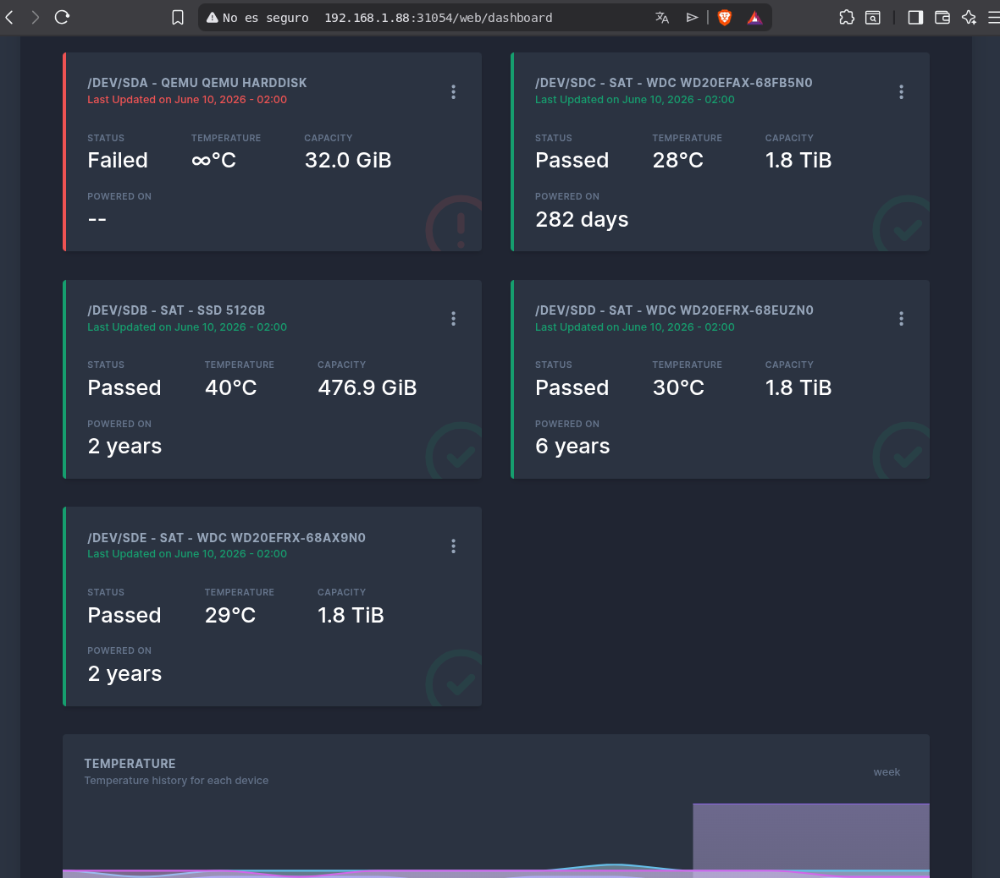

El primero es el disco del sistema, al ser una máquina virtual el disco suyo no es físico y es el que hemos importado anteriormente, es normal que no de datos reales sobre él.

## Conclusión

Al final conseguí tener todo del modo en el que quería, TrueNAS virtualizado con monitorización de discos y con estos pasados de la mejor forma posible para evitar conflictos.

No puedo evitar pensar lo útiles que me han sido las copias de seguridad ya que sin ellas me habría costado mucho más trabajo recuperar la mayoría de cosas.


